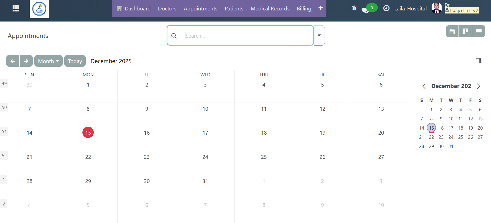
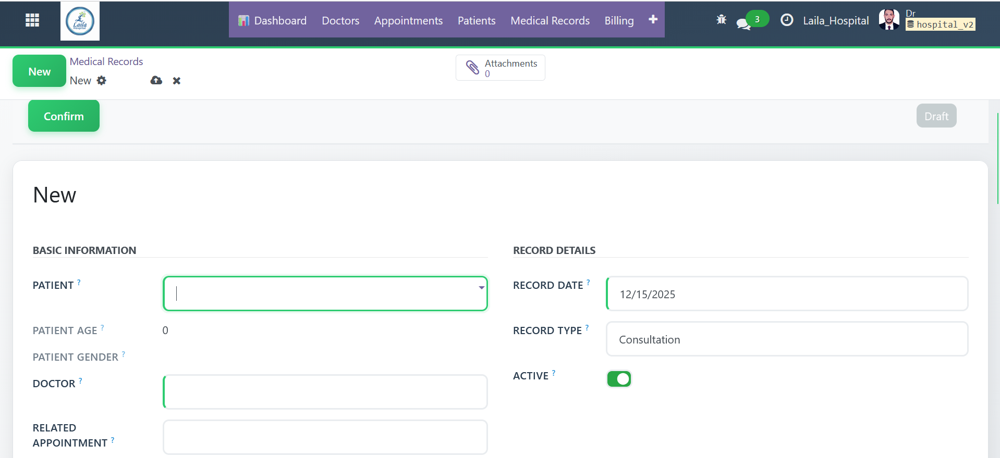
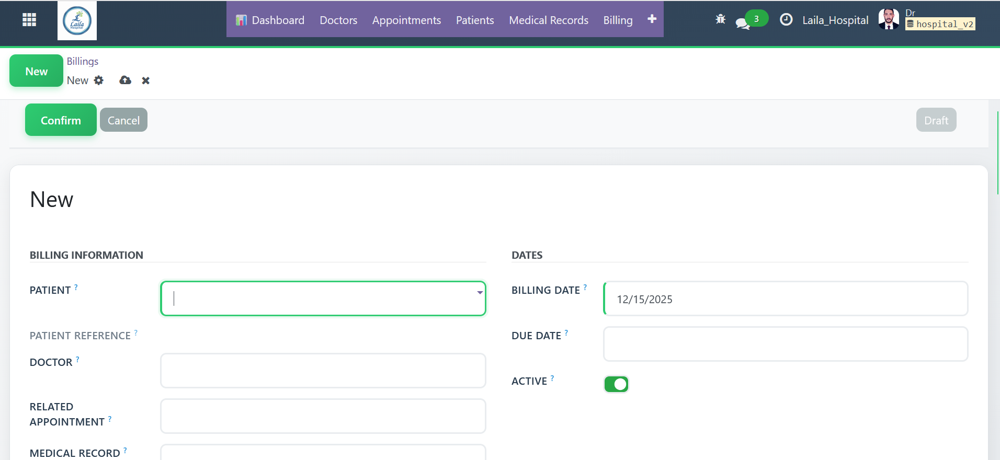
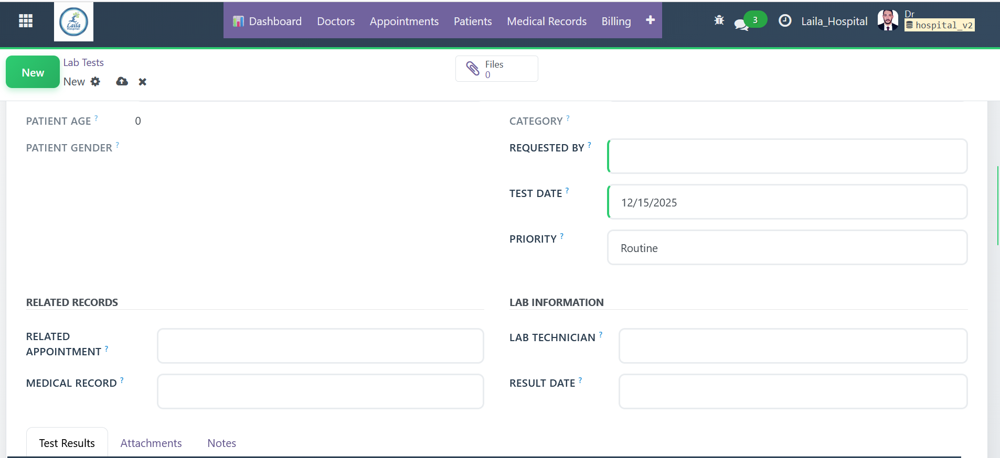
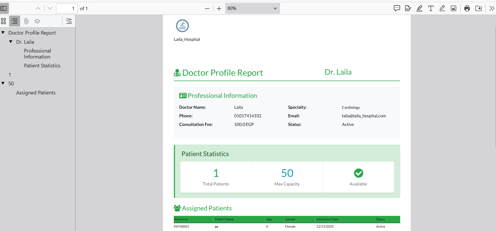
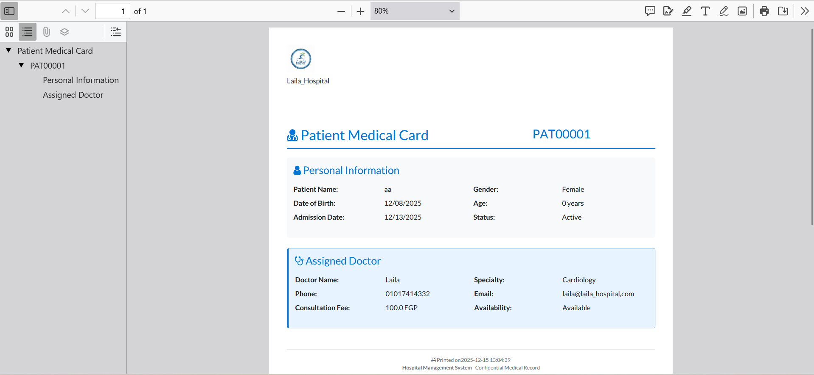

# 🏥 Hospital Management System - Odoo 18

[](https://www.odoo.com/)
[](https://www.python.org/)
[](https://www.postgresql.org/)
[](LICENSE)

> A comprehensive hospital management ERP system built on Odoo 18, featuring complete patient lifecycle management, appointment scheduling, medical records, billing, laboratory integration, and advanced analytics.

---

## 📸 Screenshots

### Dashboard & Analytics


*Real-time KPIs, patient statistics, and appointment trends with interactive charts*

### Patient Management & Workflow

*Complete patient profiles with workflow automation and medical history tracking*

### Appointment Calendar View

*Smart scheduling with conflict detection and automated notifications*

### Doctor Management

*Doctor profiles with specializations, availability, and patient load tracking*

### Medical Records (EMR)

*Electronic medical records with vital signs, diagnoses, and file attachments*

### Billing & Invoicing

*Automated invoice generation with multiple payment methods*

### Laboratory Management

*Lab test management with result tracking and abnormal flagging*

### PDF Reports



*Professional PDF reports for patients, doctors, and medical records*

---

## ✨ Features

### 👥 Patient Management
- ✅ Auto-generated patient references (PAT00001, PAT00002, ...)
- ✅ Automatic age calculation from date of birth
- ✅ Child/Adult classification with age-based workflows
- ✅ Priority management (Low, Normal, High, Very High)
- ✅ Gender tracking with visual badges
- ✅ Complete medical history timeline
- ✅ Doctor assignment with smart suggestions
- ✅ Emergency contact information
- ✅ Insurance details management
- ✅ Patient photo and document attachments
- ✅ Advanced search and filtering

### 📅 Appointment System
- ✅ Smart scheduling with conflict detection
- ✅ Calendar view (Day/Week/Month)
- ✅ Multiple appointment types (Consultation, Follow-up, Emergency)
- ✅ Status workflow: Draft → Confirmed → In Progress → Done
- ✅ Automated email notifications and reminders
- ✅ Doctor availability tracking
- ✅ Appointment history per patient
- ✅ Waiting list management
- ✅ Drag-and-drop rescheduling

### 📋 Electronic Medical Records (EMR)
- ✅ Complete digital health records
- ✅ Vital signs tracking (BP, Temperature, Pulse, Weight, Height)
- ✅ Diagnosis and symptoms documentation
- ✅ Treatment plans and procedures
- ✅ Multi-file attachments (X-rays, Lab reports, Scans)
- ✅ Medical history timeline view
- ✅ Record type categorization
- ✅ Allergy and medication alerts
- ✅ Visit notes and observations

### 💰 Billing & Invoicing
- ✅ Automated invoice generation from appointments
- ✅ Multiple service line items
- ✅ Discount and tax calculations
- ✅ Payment tracking (Paid/Unpaid/Partial)
- ✅ Multiple payment methods (Cash, Card, Bank Transfer, Insurance)
- ✅ Payment status monitoring
- ✅ Revenue reports and analytics
- ✅ Refund management
- ✅ Credit note generation
- ✅ Insurance claim processing

### 💊 Prescription Management
- ✅ Digital prescription creation
- ✅ Medicine dosage and frequency tracking
- ✅ Treatment duration management
- ✅ Dietary advice and precautions
- ✅ Follow-up scheduling
- ✅ Prescription status workflow
- ✅ Drug interaction warnings
- ✅ Prescription history per patient
- ✅ E-prescription printing

### 🔬 Laboratory Integration
- ✅ Lab test management system
- ✅ Test types and categories
- ✅ Result entry with normal ranges
- ✅ Abnormal/Critical result flagging
- ✅ Multiple test parameters
- ✅ Report attachments
- ✅ Priority handling (Routine/Urgent/STAT)
- ✅ Result notifications
- ✅ Quality control tracking

### 👨‍⚕️ Doctor Management
- ✅ Specialty categorization (Cardiology, Pediatrics, Neurology, etc.)
- ✅ Patient capacity tracking
- ✅ Automatic availability status
- ✅ Consultation fee management
- ✅ Contact information (Phone, Email)
- ✅ Real-time patient count
- ✅ Performance analytics
- ✅ Work schedule management
- ✅ Multi-department assignments

### 🔄 Workflow System
Complete patient journey tracking:
```
New → Waiting → In Consultation → Done
 ↓       ↓            ↓
    Cancel (any stage)
```

Appointment workflow:
```
Draft → Confirmed → In Progress → Done
  ↓         ↓           ↓
      Cancel (any stage)
```

### 📊 Analytics Dashboard
- ✅ Real-time KPIs and metrics
- ✅ Patient statistics and demographics
- ✅ Appointment trends and patterns
- ✅ Revenue tracking and forecasting
- ✅ Lab test analytics
- ✅ Doctor performance metrics
- ✅ Customizable date filters
- ✅ Export to PDF/Excel
- ✅ Interactive charts and graphs
- ✅ Custom report builder

### 📄 PDF Reports
- **Patient Card**: Complete medical card with all information
- **Doctor Profile**: Comprehensive doctor report with patient list
- **Appointment Summary**: Daily/weekly appointment reports
- **Medical Records**: EMR reports with vital signs
- **Billing Receipts**: Professional invoice and payment receipts
- **Prescription Reports**: Detailed medication reports
- **Lab Results**: Test result reports with normal ranges
- **Professional Layout**: Clean, printable design
- **Auto-generated**: Print button in all form views

### 🎨 Advanced Features
- **Smart Buttons**: Quick navigation between related records
- **Computed Fields**: Automatic calculations (age, patient count, totals)
- **Onchange Actions**: Auto-fill doctor for pediatric patients
- **Constraints**: Prevent doctors from exceeding capacity
- **Status Bar**: Visual workflow progression
- **Color-coded Badges**: Quick status identification
- **Progress Bars**: Visual capacity indicators
- **Kanban View**: Drag-and-drop cards with state-based columns
- **Calendar View**: Visual appointment scheduling
- **Graph View**: Analytics and reporting
- **Pivot View**: Advanced data analysis
- **Search Filters**: Quick filtering by multiple criteria
- **Group By**: Organize data by any field

### 🌍 Multi-Language Support
- ✅ Full Arabic translation with RTL support
- ✅ English interface
- ✅ Localized date/time formats
- ✅ Currency localization
- ✅ Easy language switching

### 🔒 Security Features
- ✅ Role-based access control (RBAC)
- ✅ Data encryption at rest and in transit
- ✅ Audit logging for all operations
- ✅ Session management
- ✅ Password hashing (PBKDF2)
- ✅ SQL injection prevention
- ✅ XSS protection
- ✅ CSRF tokens
- ✅ Failed login tracking
- ✅ HIPAA & GDPR compliance ready

---

## 🛠️ Technical Stack

| Technology | Version | Purpose |
|------------|---------|---------|
| **Odoo** | 18.0 | ERP Framework |
| **Python** | 3.10+ | Backend Logic |
| **PostgreSQL** | 16 | Database |
| **XML/QWeb** | - | Views & Reports |
| **JavaScript** | ES6 (OWL Framework) | Frontend Logic |
| **CSS3/SCSS** | - | Custom Styling |
| **Chart.js** | - | Interactive Charts |
| **Docker** | - | Containerization |
| **Bootstrap** | 5 | UI Framework |

---

## 📦 Installation

### Prerequisites
- Docker & Docker Compose (Recommended)
- Python 3.10+
- PostgreSQL 16
- 4GB RAM minimum (8GB recommended)
- 20GB free disk space

### Quick Start with Docker (Recommended)

1. **Clone the repository:**
```bash
git clone https://github.com/MohamedKandil14/hospital_management.git
cd hospital_management
```

2. **Start Docker containers:**
```bash
docker-compose up -d
```

3. **Access Odoo:**
- URL: http://localhost:8069
- Create new database: `hospital_v2`
- Email: admin
- Password: admin

4. **Install the module:**
- Go to **Apps**
- Remove "Apps" filter
- Search "Hospital Management"
- Click **Install**

### Manual Installation

#### Step 1: Clone to Odoo addons
```bash
cd /path/to/odoo/addons
git clone https://github.com/MohamedKandil14/hospital_management.git hospital_management
```

#### Step 2: Install Odoo 18

**On Ubuntu/Debian:**
```bash
# Install dependencies
sudo apt update
sudo apt install -y python3-pip python3-dev libxml2-dev libxslt1-dev \
    libldap2-dev libsasl2-dev libtiff5-dev libjpeg8-dev libopenjp2-7-dev \
    zlib1g-dev libfreetype6-dev liblcms2-dev libwebp-dev libharfbuzz-dev \
    libfribidi-dev libxcb1-dev libpq-dev

# Install Odoo
wget https://nightly.odoo.com/18.0/nightly/deb/odoo_18.0.latest_all.deb
sudo dpkg -i odoo_18.0.latest_all.deb
sudo apt-get install -f
```

**On Windows:**
Download and install from [Odoo Official Website](https://www.odoo.com/page/download)

#### Step 3: Setup PostgreSQL
```bash
# Create database user
sudo -u postgres createuser -s odoo
sudo -u postgres psql -c "ALTER USER odoo WITH PASSWORD 'odoo';"

# Create database
sudo -u postgres createdb hospital_v2
```

#### Step 4: Configure Odoo
Edit `/etc/odoo/odoo.conf`:
```ini
[options]
addons_path = /usr/lib/python3/dist-packages/odoo/addons,/path/to/hospital_management
db_host = localhost
db_port = 5432
db_user = odoo
db_password = odoo
```

#### Step 5: Restart Odoo
```bash
sudo systemctl restart odoo
```

#### Step 6: Install Module
1. Open browser: `http://localhost:8069`
2. Go to **Apps** → **Update Apps List**
3. Search "Hospital Management"
4. Click **Install**

---

## 📖 Usage Guide

### Quick Start

#### 1. Register a Patient
```
Navigation: Hospital → Patients → Create
- Fill patient details (Name, DOB, Gender)
- Add contact information
- Assign primary doctor
- Upload patient photo (optional)
- Save
```

#### 2. Schedule an Appointment
```
Navigation: Hospital → Appointments → Create
- Select patient (or create new)
- Choose doctor and specialization
- Select date and time
- Set appointment type
- Add notes if needed
- Click "Confirm" to send notification
```

#### 3. Create Medical Record
```
Navigation: Hospital → Medical Records → Create
- Select patient
- Record vital signs (BP, Temperature, Pulse, etc.)
- Enter symptoms and diagnosis
- Add treatment plan
- Attach medical files (X-rays, reports)
- Save record
```

#### 4. Generate Invoice
```
Navigation: Hospital → Billing → Create
- Select patient
- Add services/procedures
- Apply discounts (if any)
- Calculate total with tax
- Select payment method
- Mark as paid
- Print/Email receipt
```

#### 5. Create Prescription
```
Navigation: Hospital → Prescriptions → Create
- Select patient
- Add medicines with dosage
- Set frequency and duration
- Add dietary advice
- Schedule follow-up
- Print prescription
```

#### 6. Manage Lab Tests
```
Navigation: Hospital → Lab Tests → Create
- Select patient
- Choose test type
- Set priority (Routine/Urgent/STAT)
- Enter results with normal ranges
- Flag abnormal results
- Attach lab reports
- Notify patient
```

### Advanced Features

#### View Dashboard Analytics
```
Navigation: Hospital → Dashboard
- View real-time KPIs
- Filter by date range
- Export reports to PDF/Excel
- Analyze trends and patterns
```

#### User Roles & Permissions
- **Admin**: Full access to all modules
- **Doctor**: Patient records, prescriptions, medical records
- **Receptionist**: Appointments, patient registration
- **Billing Staff**: Invoices, payments, financial reports
- **Lab Technician**: Lab tests, results entry
- **Pharmacist**: Prescriptions, medication dispensing

---

## 📁 Project Structure

```
hospital_management/
├── __init__.py                 # Module initialization
├── __manifest__.py             # Module metadata & dependencies
│
├── models/                     # Business logic (Python)
│   ├── __init__.py
│   ├── patient.py             # Patient model with workflow
│   ├── doctor.py              # Doctor model with relations
│   ├── appointment.py         # Appointment scheduling logic
│   ├── medical_record.py      # EMR system
│   ├── billing.py             # Invoicing and payments
│   ├── prescription.py        # Digital prescriptions
│   ├── lab_test.py            # Laboratory management
│   ├── department.py          # Hospital departments
│   ├── dashboard.py           # Analytics and KPIs
│   └── insurance.py           # Insurance management
│
├── views/                      # UI definitions (XML)
│   ├── menu.xml               # Main menu structure
│   ├── patient_views.xml      # Patient list/form/kanban
│   ├── doctor_views.xml       # Doctor list/form/kanban
│   ├── appointment_views.xml  # Appointment calendar/form
│   ├── medical_record_views.xml # Medical records interface
│   ├── billing_views.xml      # Billing and invoicing
│   ├── prescription_views.xml # Prescription management
│   ├── lab_test_views.xml     # Lab test views
│   └── dashboard_views.xml    # Analytics dashboard
│
├── reports/                    # PDF reports (QWeb)
│   ├── report_template.xml    # Report actions
│   ├── patient_report.xml     # Patient card template
│   ├── doctor_report.xml      # Doctor profile template
│   ├── appointment_report.xml # Appointment summary
│   ├── medical_record_report.xml # EMR report
│   ├── billing_report.xml     # Invoice/receipt template
│   └── prescription_report.xml # Prescription template
│
├── security/                   # Access control
│   ├── ir.model.access.csv    # Model-level permissions
│   └── security.xml           # Record rules and groups
│
├── data/                       # Initial data
│   ├── sequence.xml           # Auto-numbering sequences
│   ├── email_templates.xml    # Email notification templates
│   ├── scheduled_actions.xml  # Cron jobs and automation
│   └── default_data.xml       # Default configuration
│
├── wizards/                    # Wizard dialogs
│   ├── __init__.py
│   ├── appointment_wizard.py  # Quick appointment creation
│   └── payment_wizard.py      # Payment processing
│
├── i18n/                       # Translations
│   ├── ar.po                  # Arabic translation
│   └── en.po                  # English (base)
│
├── static/                     # Assets
│   ├── description/
│   │   ├── icon.png           # Module icon (128x128)
│   │   └── banner.png         # App store banner
│   └── src/
│       ├── css/
│       │   ├── style.css      # Custom styles
│       │   └── custom_theme.css # Hospital theme
│       ├── scss/
│       │   └── custom_theme.scss # SCSS source
│       ├── js/
│       │   ├── dashboard.js   # Dashboard interactions
│       │   └── calendar.js    # Calendar enhancements
│       └── img/
│           └── logo.png       # Hospital logo
│
├── tests/                      # Unit tests (optional)
│   ├── __init__.py
│   ├── test_patient.py
│   ├── test_appointment.py
│   └── test_billing.py
│
├── screenshots/                # Demo images
│   ├── 1.png
│   ├── 2.png
│   └── ...
│
├── docker-compose.yml          # Docker configuration
├── requirements.txt            # Python dependencies
├── LICENSE                     # LGPL-3 License
└── README.md                   # This file

**Mohamed Kandil**

- GitHub: [@MohamedKandil14](https://github.com/MohamedKandil14)


**Project Link**: [https://github.com/MohamedKandil14/hospital_management](https://github.com/MohamedKandil14/hospital_management)

---

## 🗺️ Roadmap

### ✅ Completed (Phase 1)
- [x] Patient Management with workflow
- [x] Doctor Management with specializations
- [x] Appointment System with calendar
- [x] Medical Records (EMR)
- [x] Billing & Invoicing
- [x] Prescriptions
- [x] Lab Tests
- [x] Analytics Dashboard
- [x] PDF Reports
- [x] Multi-language Support
- [x] Email Notifications
- [x] Kanban Views

### 🚧 In Progress (Phase 2)
- [ ] Bed/Room Management
- [ ] Pharmacy Integration
- [ ] Insurance Claims Processing
- [ ] SMS Notifications
- [ ] Advanced Analytics with AI
- [ ] Telemedicine Integration

### 📅 Planned (Phase 3)
- [ ] Patient Portal (Web)
- [ ] Mobile App (Android/iOS)
- [ ] IoT Device Integration
- [ ] Voice-to-text Dictation
- [ ] DICOM Image Viewer
- [ ] HL7 Integration
- [ ] Blockchain for Records
- [ ] Predictive Analytics


Made with ❤️ by [Mohamed Kandil](https://github.com/MohamedKandil14)


