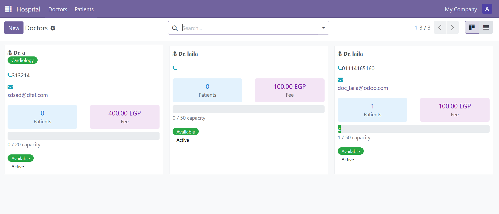
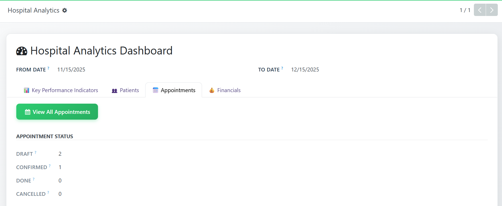
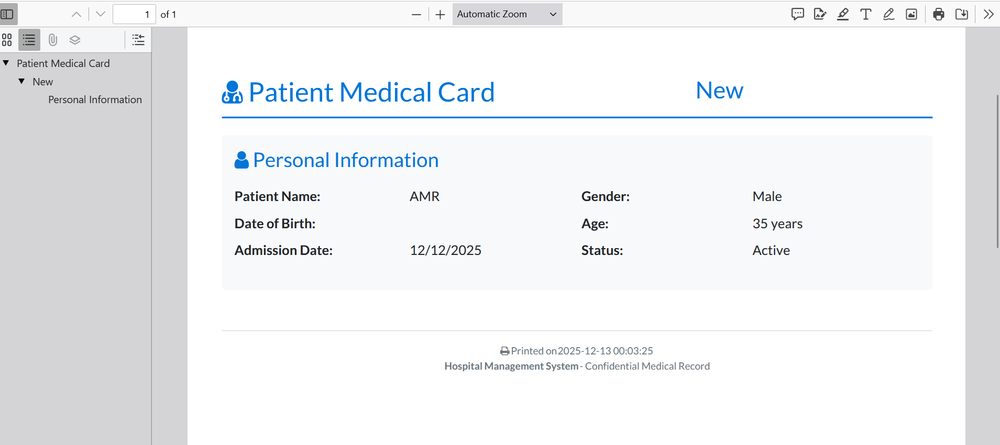

# 🏥 Hospital Management System - Odoo 18


A comprehensive hospital management system built on Odoo 18, featuring patient management, doctor scheduling, workflow automation, and detailed reporting.

## 📸 Screenshots

### Dashboard & Kanban View


### Patient Form with Workflow


### PDF Reports


### Doctor Profile


---

## ✨ Features

### 👥 Patient Management
- ✅ Auto-generated patient references (PAT00001, PAT00002, ...)
- ✅ Automatic age calculation from date of birth
- ✅ Child/Adult classification
- ✅ Priority management (Low, Normal, High, Very High)
- ✅ Gender tracking with visual badges
- ✅ Medical notes and history
- ✅ Doctor assignment with suggestions

### 👨‍⚕️ Doctor Management
- ✅ Specialty categorization (Cardiology, Pediatrics, Neurology, etc.)
- ✅ Patient capacity tracking
- ✅ Automatic availability status
- ✅ Consultation fee management
- ✅ Contact information (Phone, Email)
- ✅ Real-time patient count

### 🔄 Workflow System
Complete patient journey tracking:
```
New → Waiting → In Consultation → Done
 ↓       ↓            ↓
    Cancel (any stage)
```

### 📊 Views & UI
- **Kanban View**: Drag-and-drop cards with state-based columns
- **List View**: Sortable table with filters
- **Form View**: Detailed patient/doctor information
- **Search Filters**: Quick filtering by state, priority, doctor
- **Group By**: Organize data by status, gender, specialty
- **Priority Ribbons**: Visual indicators for urgent cases

### 📄 PDF Reports
- **Patient Card**: Complete medical card with all information
- **Doctor Profile**: Comprehensive doctor report with patient list
- **Professional Layout**: Clean, printable design
- **Auto-generated**: Print button in form views

### 🎨 Advanced Features
- **Smart Buttons**: Quick navigation between related records
- **Computed Fields**: Automatic calculations (age, patient count)
- **Onchange Actions**: Auto-fill doctor for pediatric patients
- **Constraints**: Prevent doctors from exceeding capacity
- **Status Bar**: Visual workflow progression
- **Color-coded Badges**: Quick status identification
- **Progress Bars**: Visual capacity indicators

---

## 🛠️ Technical Stack

| Technology | Version | Purpose |
|------------|---------|---------|
| **Odoo** | 18.0 | ERP Framework |
| **Python** | 3.10+ | Backend Logic |
| **PostgreSQL** | 16 | Database |
| **XML/QWeb** | - | Views & Reports |
| **JavaScript** | ES6 | Frontend Logic |
| **CSS3** | - | Custom Styling |
| **Docker** | - | Containerization |

---

## 📦 Installation

### Prerequisites
- Docker & Docker Compose
- Python 3.10+
- PostgreSQL 16

### Quick Start with Docker

1. **Clone the repository:**
```bash
git clone https://github.com/YOUR_USERNAME/odoo-hospital-management.git
cd odoo-hospital-management
```

2. **Start Docker containers:**
```bash
docker-compose up -d
```

3. **Access Odoo:**
- URL: http://localhost:8069
- Database: Create new database
- Email: admin
- Password: admin

4. **Install the module:**
- Go to Apps
- Remove "Apps" filter
- Search "Hospital Management"
- Click Install

### Manual Installation

1. **Clone to Odoo addons:**
```bash
cd /path/to/odoo/addons
git clone https://github.com/YOUR_USERNAME/odoo-hospital-management.git hospital_management
```

2. **Restart Odoo:**
```bash
sudo systemctl restart odoo
```

3. **Update Apps List:**
- Go to Apps → Update Apps List
- Install "Hospital Management"

---

## 📁 Project Structure

```
hospital_management/
├── __init__.py                 # Module initialization
├── __manifest__.py             # Module metadata & dependencies
├── models/                     # Business logic
│   ├── __init__.py
│   ├── patient.py             # Patient model with workflow
│   └── doctor.py              # Doctor model with relations
├── views/                      # UI definitions
│   ├── patient_views.xml      # Patient list/form/kanban
│   └── doctor_views.xml       # Doctor list/form/kanban
├── reports/                    # PDF reports
│   ├── report_template.xml    # Report actions
│   ├── patient_report.xml     # Patient card template
│   └── doctor_report.xml      # Doctor profile template
├── security/                   # Access control
│   └── ir.model.access.csv    # User permissions
├── data/                       # Initial data
│   └── sequence.xml           # Auto-numbering
├── static/                     # Assets
│   └── src/
│       └── css/
│           └── style.css      # Custom styles
└── docker-compose.yml          # Docker configuration
```

---

## 🎯 Key Technical Implementations

### 1. **Relational Database Design**
```python
# Many2one: Patient → Doctor
doctor_id = fields.Many2one('hospital.doctor', string='Doctor')

# One2many: Doctor → Patients
patient_ids = fields.One2many('hospital.patient', 'doctor_id', string='Patients')
```

### 2. **Computed Fields with Dependencies**
```python
@api.depends('age')
def _compute_is_child(self):
    for record in self:
        record.is_child = record.age < 18 if record.age else False
```

### 3. **Onchange Methods**
```python
@api.onchange('date_of_birth')
def _onchange_date_of_birth(self):
    if self.date_of_birth:
        self.age = relativedelta(date.today(), self.date_of_birth).years
```

### 4. **Workflow State Machine**
```python
def action_waiting(self):
    for record in self:
        if record.state == 'new':
            record.state = 'waiting'
```

### 5. **Constraints & Validations**
```python
@api.constrains('patient_ids', 'max_patients')
def _check_max_patients(self):
    if len(self.patient_ids) > self.max_patients:
        raise ValidationError('Doctor capacity exceeded!')
```

### 6. **QWeb Reports**
```xml
<t t-foreach="docs" t-as="patient">
    <div class="page">
        <field name="name"/>
        <field name="age"/>
    </div>
</t>
```

### 7. **Kanban Views with Drag & Drop**
```xml
<kanban default_group_by="state">
    <field name="state"/>
    <templates>
        <t t-name="card">
            <!-- Card content -->
        </t>
    </templates>
</kanban>
```

---

## 📊 Database Schema

### **hospital_patient**
| Field | Type | Description |
|-------|------|-------------|
| id | Integer | Primary Key |
| reference | Char | Auto-generated (PAT00001) |
| name | Char | Patient name |
| age | Integer | Calculated from DOB |
| gender | Selection | Male/Female/Other |
| date_of_birth | Date | Birth date |
| doctor_id | Many2one | Assigned doctor |
| state | Selection | Workflow state |
| priority | Selection | 0-3 (Normal to Very High) |
| is_child | Boolean | Computed field |
| notes | Text | Medical notes |

### **hospital_doctor**
| Field | Type | Description |
|-------|------|-------------|
| id | Integer | Primary Key |
| name | Char | Doctor name |
| specialty | Selection | Medical specialty |
| phone | Char | Contact number |
| email | Char | Email address |
| consultation_fee | Float | Fee amount |
| patient_count | Integer | Number of patients |
| max_patients | Integer | Maximum capacity |
| availability | Selection | Available/Busy/On Leave |
| patient_ids | One2many | Related patients |

---

## 🎓 Skills Demonstrated

### **Odoo Development**
✅ Model creation with ORM  
✅ View development (List, Form, Kanban, Search)  
✅ QWeb templating for reports  
✅ Workflow implementation  
✅ Computed fields and onchange methods  
✅ Constraints and validations  
✅ Security and access rights  
✅ Module structure and manifest  

### **Python Programming**
✅ Object-oriented programming  
✅ Decorators (@api.depends, @api.onchange)  
✅ Exception handling  
✅ Date/time calculations  
✅ List comprehensions  
✅ Type hints  

### **Database Design**
✅ One2many / Many2one relationships  
✅ Computed fields with storage  
✅ Domain filters  
✅ SQL constraints  

### **Frontend Development**
✅ XML view definitions  
✅ QWeb templating  
✅ CSS styling  
✅ Bootstrap integration  
✅ Responsive design  

### **DevOps**
✅ Docker containerization  
✅ Docker Compose orchestration  
✅ Version control with Git  

---

## 📈 Future Enhancements

- [ ] REST API endpoints
- [ ] Appointment scheduling with calendar view
- [ ] SMS/Email notifications
- [ ] Medical records with file attachments
- [ ] Billing and invoicing
- [ ] Prescription management
- [ ] Lab test results integration
- [ ] Multi-language support
- [ ] Mobile app integration
- [ ] Analytics dashboard with charts


**⭐ If you found this project helpful, please give it a star!**
